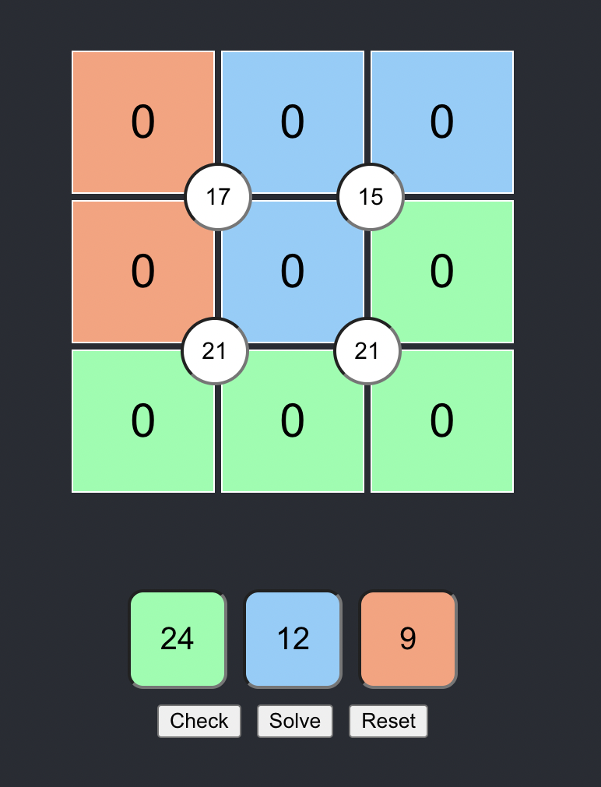

# Suko Solver

Suko is a game where you must use the numbers 1 to 9 to satisty constraints on
a 3 by 3 grid.

The four boxes surrounding each circle must add up to the number inside the circle,
and the the sum of the coloured boxes must add up to each colours total.

